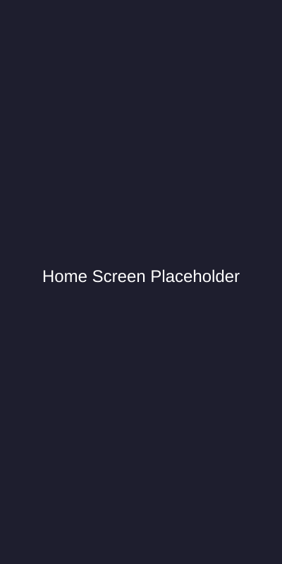
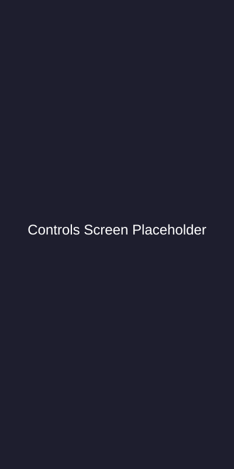
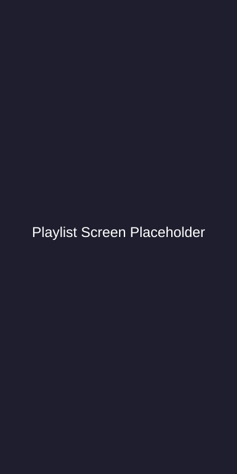

# VLC Remote Flutter 🎵

<div align="center">


**Telecomando remoto moderno per VLC Media Player**

Un'applicazione Flutter cross-platform per controllare VLC Media Player da remoto tramite rete locale.

[Caratteristiche](#caratteristiche) • [Installazione](#installazione) • [Utilizzo](#utilizzo) • [Configurazione VLC](#configurazione-vlc) • [English Version](README_EN.md) • [Changelog](CHANGELOG_IT.md)

</div>

---

## 📱 Screenshot

<p align="center">
  
  
  
</p>

## ✨ Caratteristiche

### 🎯 Funzionalità Core
- ✅ **Controllo Completo**: Play, Pause, Stop, Avanti, Indietro
- ✅ **Gestione Volume**: Mappatura precisa 0-100% con sincronizzazione atomica
- ✅ **Seek Bar**: Navigazione temporale fluida con protezione dai salti
- ✅ **Fullscreen**: Toggle modalità schermo intero
- ✅ **Kill VLC**: Terminazione forzata di tutte le istanze VLC (locale e remota)
- ✅ **Anteprima Playlist**: Visualizza i titoli della playlist generata prima di avviare la riproduzione (integrato con MyPlaylist)
- ✅ **Sincronizzazione Robusta**: Cancellazione echi del server per dati sempre accurati

### 🚀 Miglioramenti Rispetto all'Originale

#### 🎨 UI/UX Moderna
- **Material Design 3**: Design moderno e accattivante
- **Dark/Light Mode**: Supporto temi chiaro e scuro
- **Animazioni Fluide**: Transizioni e feedback visivi
- **Responsive**: Ottimizzato per phone, tablet e desktop

#### 💾 Gestione Connessioni
- **Connessioni Multiple**: Salva e gestisci più server VLC
- **Preferiti**: Marca le connessioni più usate
- **Auto-Reconnect**: Riconnessione automatica all'ultima connessione
- **Validazione Input**: Controlli di validità per IP e porta

#### 🔧 Architettura Migliorata
- **Provider Pattern**: State management con Provider
- **Servizi Separati**: Architettura modulare e manutenibile
- **Aggiornamenti Real-time**: Stato sincronizzato automaticamente
- **Error Handling**: Gestione errori robusta

### 🌍 Cross-Platform
- ✅ Android
- ✅ iOS
- ✅ Linux
- ✅ Windows
- ✅ macOS
- ✅ Web

---

## 📋 Requisiti

### Per l'App
- Flutter SDK >= 3.10.3
- Dart SDK >= 3.0.0

### Per VLC
- VLC Media Player installato sul computer
- Rete locale (stessa WiFi/LAN)

---

## 🚀 Installazione

### 1. Clona il Repository
```bash
git clone https://github.com/losciuto/vlcremote-flutter.git
cd vlcremote-flutter
```

### 2. Installa le Dipendenze
```bash
flutter pub get
```

### 3. Esegui l'App
```bash
# Android
flutter run -d android

# iOS
flutter run -d ios

# Linux
flutter run -d linux

# Windows
flutter run -d windows

# Web
flutter run -d chrome
```

---

## 🎮 Utilizzo

### 1. Configura VLC

Prima di utilizzare l'app, devi avviare VLC con l'interfaccia RC (Remote Control) abilitata:

#### Linux/macOS
```bash
vlc /path/to/playlist.m3u --intf rc --rc-host 0.0.0.0:8000
```

#### Windows
```cmd
"C:\Program Files\VideoLAN\VLC\vlc.exe" "C:\path\to\playlist.m3u" --intf rc --rc-host 0.0.0.0:8000
```

**Parametri:**
- `--intf rc`: Abilita l'interfaccia Remote Control
- `--rc-host 0.0.0.0:8000`: Ascolta su tutte le interfacce di rete sulla porta 8000

### 2. Trova l'Indirizzo IP del Computer

#### Linux
```bash
ip addr show | grep inet
```

#### macOS
```bash
ifconfig | grep inet
```

#### Windows
```cmd
ipconfig
```

Cerca l'indirizzo IP della tua rete locale (es. `192.168.1.15`)

### 3. Connetti l'App

1. Apri l'app VLC Remote
2. Tocca l'icona di connessione in alto a destra
3. Tocca "Nuova Connessione"
4. Inserisci:
   - **Nome**: Un nome descrittivo (es. "VLC Casa")
   - **IP**: L'indirizzo IP del computer (es. `192.168.1.15`)
   - **Porta**: La porta configurata (default: `8000`)
5. Tocca "Salva e Connetti"

### 4. Controlla VLC

Una volta connesso, puoi:
- ▶️ **Play/Pause/Stop**: Controlla la riproduzione
- ⏮️⏭️ **Prev/Next**: Naviga tra i brani
- 🔊 **Volume**: Aumenta/Diminuisci il volume
- 🖥️ **Fullscreen**: Attiva/Disattiva schermo intero
- 📊 **Seek**: Scorri la timeline del video
- 📝 **Playlist**: Visualizza e seleziona i brani (in sviluppo)

---

## 🔧 Configurazione VLC

### Configurazione Permanente

Per evitare di dover avviare VLC da terminale ogni volta, puoi creare uno script:

#### Linux/macOS
Crea un file `vlc-remote.sh`:
```bash
#!/bin/bash
vlc /path/to/your/playlist.m3u --intf rc --rc-host 0.0.0.0:8000
```

Rendilo eseguibile:
```bash
chmod +x vlc-remote.sh
```

#### Windows
Crea un file `vlc-remote.bat`:
```batch
@echo off
"C:\Program Files\VideoLAN\VLC\vlc.exe" "C:\path\to\playlist.m3u" --intf rc --rc-host 0.0.0.0:8000
```

### Porta Personalizzata

Se la porta 8000 è già in uso, puoi cambiarla:
```bash
vlc playlist.m3u --intf rc --rc-host 0.0.0.0:9000
```
Ricorda di usare la stessa porta nell'app!

### Configurazione HTTP API (Sperimentale / Consigliata)

Dalla versione 2.5.0, VlcRemote supporta l'**API HTTP** di VLC per una maggiore robustezza nel polling di playlist e stato. L'API HTTP richiede l'inserimento di una **password** in VLC:

1. Avvia VLC normalmente (senza file multimediali) e vai in **Strumenti** -> **Preferenze** -> spunta "Tutto" (in basso a sinistra).
2. Nel menù a sinistra: **Interfacce primarie** -> seleziona **Web**.
3. Espandi "Interfacce primarie" -> **Lua** -> in "Interfaccia HTTP" inserisci una **Password** (ad es. "1234").
4. Chiudi VLC.
5. In alternativa, puoi avviare VLC da riga di comando o script combinando entrambe le interfacce (`rc` e `http`):
   ```bash
   vlc --extraintf=http --http-password="tua-password" --intf rc --rc-host 0.0.0.0:8000
   ```
6. Nella pagina di configurazione di VlcRemote, inserisci la password impostata in precedenza, assicurandoti che l'IP e la porta (di solito `8080` per HTTP se omessa quella speciale) corrispondano a quelli di VLC. *Nota: se la porta HTTP differisce dalla porta del Socket (es. HTTP su 8080 e Socket su 8000) potresti aver bisogno di testare quale far prevalere. Attualmente VlcRemote riutilizza lo stesso numero di porta per entrambi i servizi.*

---

## 🏗️ Architettura

```
lib/
├── main.dart                 # Entry point
├── models/                   # Modelli dati
│   ├── vlc_connection.dart
│   ├── vlc_status.dart
│   └── playlist_item.dart
├── services/                 # Servizi business logic
│   ├── vlc_service.dart
│   └── connection_service.dart
├── providers/                # State management
│   └── vlc_provider.dart
├── screens/                  # Schermate
│   └── home_screen.dart
└── widgets/                  # Widget riutilizzabili
    ├── connection_dialog.dart
    ├── control_panel.dart
    ├── now_playing_card.dart
    └── playlist_panel.dart
```

### Pattern Utilizzati
- **Provider**: State management reattivo
- **Service Layer**: Separazione logica di business
- **Repository Pattern**: Gestione dati persistenti

---

## 🛠️ Sviluppo

### Build Release

#### Android APK
```bash
flutter build apk --release
```

#### Android App Bundle
```bash
flutter build appbundle --release
```

#### iOS
```bash
flutter build ios --release
```

#### Linux
```bash
flutter build linux --release
```

#### Windows
```bash
flutter build windows --release
```

### Testing
```bash
flutter test
```

### Analisi Codice
```bash
flutter analyze
```

---

## 📦 Dipendenze Principali

- **provider**: State management
- **shared_preferences**: Storage locale
- **http**: Comunicazione di rete (future)
- **network_info_plus**: Informazioni rete
- **intl**: Internazionalizzazione

---

## 🗺️ Roadmap

### Versione 1.1
- [ ] Implementazione completa gestione playlist
- [ ] Auto-discovery VLC sulla rete locale
- [ ] Supporto HTTP API di VLC
- [ ] Widget per controllo rapido

### Versione 1.2
- [ ] Supporto multi-lingua (IT, EN, ES, FR, DE)
- [ ] Temi personalizzabili
- [ ] Gesture controls (swipe per volume/seek)
- [ ] Notifiche per cambio brano

### Versione 2.0
- [ ] Streaming audio/video
- [ ] Equalizzatore
- [ ] Sottotitoli
- [ ] Chromecast support

---

## 🤝 Contribuire

I contributi sono benvenuti! Per favore:

1. Fai un Fork del progetto
2. Crea un branch per la tua feature (`git checkout -b feature/AmazingFeature`)
3. Commit le tue modifiche (`git commit -m 'Add some AmazingFeature'`)
4. Push al branch (`git push origin feature/AmazingFeature`)
5. Apri una Pull Request

---

## 📄 Licenza

Questo progetto è rilasciato sotto licenza MIT. Vedi il file `LICENSE` per i dettagli.

---

## 👨‍💻 Autore

**losciuto**

- Versione originale Android: [losciuto/vlcremote](https://github.com/losciuto/vlcremote)
- Versione Flutter: 2.6.0 (Marzo 2026)

---

## 🙏 Ringraziamenti

- VLC Media Player team per l'eccellente media player
- Flutter team per il fantastico framework
- Comunità open source per il supporto

---

## 📞 Supporto

Se incontri problemi:

---
1.  **Stabilità della Connessione**: Dalla versione 2.5.0 sono stati risolti problemi di memory leak legati ai timer di aggiornamento. Se l'app perde la connessione, un sistema di *exponential backoff* tenterà la riconnessione automatica senza sovraccaricare il dispositivo.
2.  **Validazione IP**: Assicurati di inserire indirizzi IP nel formato corretto (es. `192.168.1.15`). L'app ora valida rigorosamente ogni ottetto per prevenire errori di connessione silenti.
3.  **VLC Remote Control**: Ricorda che VLC deve essere avviato con l'interfaccia RC abilitata (`--intf rc --rc-host 0.0.0.0:8000`).

---

<div align="center">

**Fatto con ❤️ e Flutter**

⭐ Se ti piace questo progetto, lascia una stella!

</div>
